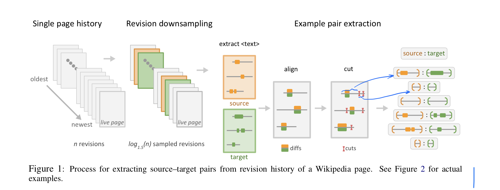

# Corpora Generation for Grammatical Error Correction

## Abstract
(Notes) Machine translation problem: seq transduction problem.
(Bg) GEC lacks plentiful parallel data.
(Contributions / Methods) 2 approaches for generating data using Wikipedia edit histories.
  1. Mining real-world erorrs by extracting src-trg pairs from Wikipedia edit histories with minimal filtration heuristics.
  2. Introducing noise into Wikipedia sentences via round-trip translation.
(Notes) GEC: loosely supervised nature -> iterative decoding.
(Experiments)
  + Fine tuning the models trained on the pseudo data with Lang-8 corpus enhances the performance.
  + Ensembling the models trained on the pseudo data enhances the performance.

## 1. Introduction
(Notes) Lang-8 is the largest publicly available parallel corpus (until 2020).
(Method 1 detail) Minimal filtering is for a large and noisy corpus.
  + Pros: A large number of real grammatical corrections.
  + Cons: Noise including
    + drastic semantic changes
    + imperfect corrections
    + ignored errors
    + Wikipedia spam.
(Method 2 detail) By corrupting clean sentences.
  + Pros: Relatively clean errors
  + Cons: Limited to the domain of errors that the translation models are prone to making.
(Both Methods) Pro: The broad scope of topics in Wikipedia.
(GEC model) Transformer.

## 2. Data Generation from Wikipedia Revision Histories
(Method 1) 
(Method 1)
1. Discard large pages
2. Downsample (to prevent imbalance distribution)
3. Extract texts
4. Align texts
5. Probabilistically cut aligned text, skipping over non-aligned seqs
6. Probabilistically introduce spelling errors to train a model proficient at grammar and spelling correction
    + deletion
    + insertion
    + replacement
    + transposition of adjacent chrs
7. Throw out examples exceeding a max len of word-pieces
8. Downsample identity examples

(Method 1 Limitation) The vast majority of the generated data are not grammatical errors.

## 3. Data Generation from Round-trip Translation
(Method 2) Round trip translation via a bridge language using discarded identical examples in method 1.
(Method 2) Round trip translation introduce noise according to both the
+ weaknesses of the translation models
+ various inheritant ambiguous of translation
( Method 2) Bridge languages:
+ Fr
+ De
+ Ja
+ Ru
for that they are
+ high resource languages
+ dissimilar from each other
(Model) The one proposed by Google's Neural Machine Translation System: Bridging the Gap between Human and Machine Translation
(Method 2)
1. Round trip translation
2. Augmentation for more identity exampels
3. Probabilistically introduce spelling errors to train a model proficient at grammar and spelling correction
    + deletion
    + insertion
    + replacement
    + transposition of adjacent chrs
4. Stochastically introducing common errors identified in Wikipedia byapplying rules learned from extracted esits of up to 3 words whose src and trg phrases are close in edit distance, and which do not contain numbers or capitalization, with the probability computed with $P(original | revised) = \frac{C(original, revised)}{C(revised)}$.
(Method 2 detail) Target sentences in the generated corpora using this method are less likely to contain
+ poor grammar
+ misspellings
+ spam
than the targets of the revision data as trgs of this method are sentences that were left unchanged for at least one revision.
(Method 1 & 2 detail)
Method 1: Polluted by significant noise, but has a good coverage of the domain of real-world ge.
Method 2: The errors introduced are relatively clean, but represents only a subset of the domain of real-world errors.

## 5. Model
(Model) Transformer.
(Model) BPE.
(Data) Lang-8 (partial) for fine-tuning as dev set.
