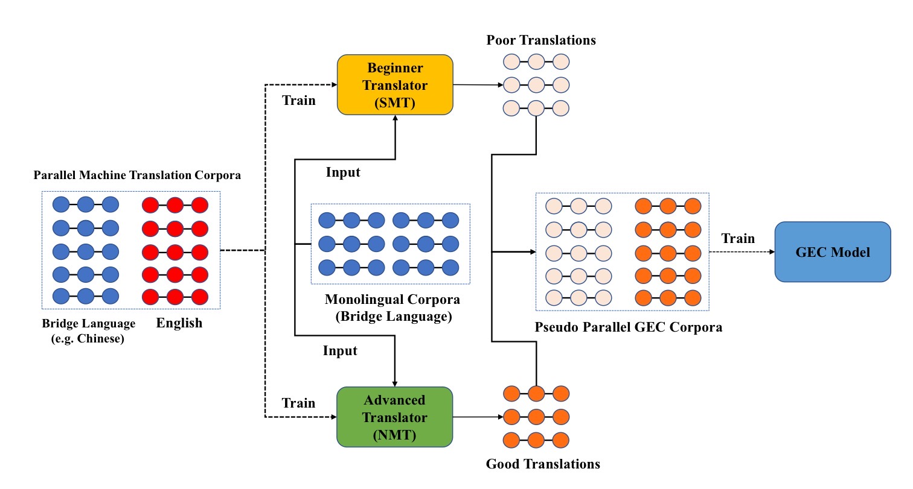

# Improving Grammatical Error Correction with Machine Translation Pairs

## 1. Background
Error patterns generated by the existing data synthesis approaches are limited by
1. Pre-defined rule sets  

2. Seed erorr-corrected training data.  #?

## 2. Motivation
Motivated by the studies which found that ESL learners tend to compose an Eng sentence by
1. literally  

translating an Eng sentence from their native language with little consideration of  

2. grammar

and the  

3. expression custom  

in Eng.

## 3. What's Done
Proposed a new data synthesis method to generate error-corrected sentence pairs of

1. diverse fluency-improving patterns  

, which is based on two translation models of different qualities (poor and good),  

and

2. can be combined with other synthetic data

to yield further improvements

## 4. Methods

Chinese is chosen to be the field language as it is less similar to Eng and may cover more error patterns.

### 4.1. Beginner Translator
1. Resembles the ESL learners, which produce translations that are   
    1. meaning-preserving

    2. not fluent

    3. grammatically incorrect`

    SMT is chosen as the beginner model as it produces translations with the three properties above.

2. Weight of the LM is reduced in the tuned beginner translator, for that synthesized parallel data can help GEC training more effectively when src sentences are of lower fluency.

### 4.2. Advanced Translator
1. Acts as correct sentences.
    1. meaning-preserving

    2. fluent

    3. grammatically correct

2. Ground-truth translations from parallel translation datasets are used to combined with outputs of the advanced translator to form the pseudo data for that ground-truth translations are cheaper to get, and that SMT models decode much faster than large NMT models

## 5. Models
### 5.1. Beginner Translation Model
  1. Phrase-based model implemented by Moses
      + MGIZA++ for word-aligning

  2. KenLM for a tri-gram LM.

#### 5.1.1. Criterion
  + BLEU

#### 5.1.2. Optim
  + MERT

#### 5.1.3. Details
  1. Weigths of each compoennt is tunued in the Moses sys.

  2. 2 duplicas of the tunued model is created by manually increasing or decreasing the weight of LM by a factor of 50%, for cmp.

### 5.2. Advanced Translation Model
  + Transformer big.

#### 5.2.1. Hyper-params
  1. 6 layers for both.

  2. 16 attn heads.

  3. `d_model` = 1024

  4. `d-ff` = 4096

### 5.3. GEC Model
  + the same as the advanced model with tied output layer, dec emb and enc emd.

#### 5.3.1. Optim
  + Adam, with lr = 0.0002 & linear warm-up for the first 8k updates

## 6. Data
### 6.1. Datasets
#### 6.1.1. Translation Models
+ UN Corpus

#### 6.1.2. Synthesizing
+ news2016zh

#### 6.1.3. Monolingual sentences for corruption (for cmp)
+ NewsCrawl

#### 6.1.4. GEC
1. BEA19

2. CoNLL 2014 test set (for testing)

#### 6.1.5. Datasets in the fine-tuning exp.
1. Lang8

2. NUCLE

### 6.2. Pseudo data filtering
1. Sentence pairs generated whose trg fluency is worse than the src's are filterd out. The fluency is measured by perplexity under an LM.  

2. 20% pairs with the lowest fluency improvement are also filtered out.

### 6.3. Data preprocessing
1. BPE for the beginner and Advanced

2. BPE for GEC with shared codes for input and output

## 8. Results and findings
### 8.1. Unsupervised GEC training
1. Different data synthesis method can be combined to produce pseudo data with more complementary error patterns.

2. Data generated by the proposed method is more realistic than that generated by predefined-rules.

### 8.2. Qualitative Analysis
1. Random corruption: limited artificial errors such as repetition & deletion of tokens, limited in the token-lv=evel errors

2. The proposed method: realistic errors, span-level.

### 8.3. Ablation Study
1. Both beginner-advanced translator pairs and beginner-gold translation pairs contributes to the data.

2. The beginner-gold one is more effective, which may be the trg sentences contain fewer noises.

3. The beginner-advanced one is able to generate data with unlimited size and domain, more general and flexible, cmp to the beginner-gold one.

## 9. Notes
### 9.1. Notes of Phrase-based SMT
1. Based on the noisy channel model.   

    $\arg \max_{\boldsymbol trg} p(\boldsymbol trg | \boldsymbol src) = \arg \max_{\boldsymbol trg} p(\boldsymbol src | \boldsymbol trg) p(\boldsymbol trg)$

    $p(\boldsymbol src | \boldsymbol trg)$: a phrase-based translation model containing a phrase dictionary, which makes the translation adequate.  
    $p(\boldsymbol trg)$: LM of the trg lang, which makes translation more fluent and grammatically correct.   

    Two models are combined with weights tuned on a valid set, indicating the relative importance.
